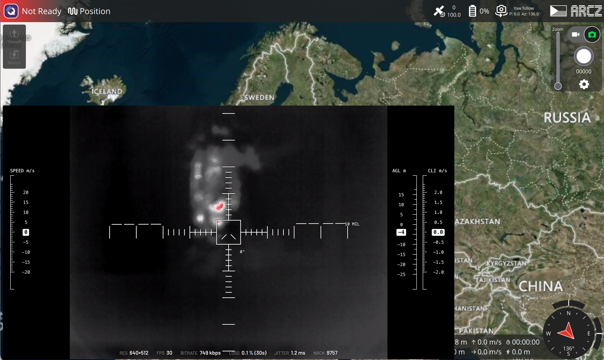

# QGroundControl-MALP

Ground station for MALP drones — a fork of [QGroundControl](https://github.com/mavlink/qgroundcontrol).

## Why a fork

MALP is a system for combat drones developed by the Czech organisation Aerorozvědka, and this fork
adapts QGroundControl for their tactical use. Stock QGroundControl cannot receive WebRTC video,
which keeps the picture together over the lossy links these drones fly on, and it has no aiming
overlay for estimating range from the video. The fork adds exactly that and keeps everything else
as upstream has it, so it follows QGroundControl's development instead of drifting away from it.



**[Download the latest release](https://github.com/aerorozvedka/malp-qgc-releases/releases/latest)**

## Features

- **WebRTC video (WHEP)** — a drone that announces a WHEP stream over MAVLink configures the video without typing an address
- **Link quality over the video** — resolution, frame rate, bitrate, packet loss, jitter and NACKs, with an amber or red edge when the link degrades
- **Tactical OSD** — mil reticle with the value of one division, speed / AGL / climb tapes, artificial horizon, gimbal pitch and zoom
- **Tactical OSD settings** — colour and opacity on the Video settings page, turned down for night flying
- **Photo and video feedback** — the captured photo flashes over the video, and the camera's recording messages appear in the same corner
- **Tells itself apart** — ARCZ mark in the toolbar and the version in the application name, e.g. `QGroundControl-MALP-v1.2.1`

Everything else is stock QGroundControl.

## Install

Download the file for your platform from the
[latest release](https://github.com/aerorozvedka/malp-qgc-releases/releases/latest).
Each release lists SHA-256 checksums in its notes. The builds are not signed yet,
so every platform asks for one extra confirmation on first launch.

The application can sit next to a stock QGroundControl; its settings are kept separately.

### macOS

macOS 13 or newer, Apple Silicon or Intel — file `QGroundControl-MALP-<version>-macOS-universal.dmg`.

1. Open the DMG and drag **QGroundControl-MALP-&lt;version&gt;** onto **Applications**.
2. Start it from Applications. macOS refuses the first launch because the build is unsigned.
3. Open **System Settings → Privacy & Security**, scroll to the message about
   QGroundControl-MALP and click **Open Anyway**, then confirm.

From then on it starts normally.

### Windows

Windows 10 or 11, x64 — the installer ending in `-Windows-AMD64.exe`.

1. Run the installer.
2. If SmartScreen shows *Windows protected your PC*, click **More info → Run anyway**.
3. Finish the installer. It installs as **QGC MALP**; the last page offers to start the
   application and to create a desktop shortcut.

### Linux and Steam Deck

x86_64 — file `QGroundControl-MALP-<version>-x86_64.AppImage`. Nothing to install:
the AppImage is a single file that carries its own libraries, video plugins included.

On the Steam Deck switch to **Desktop Mode** first (STEAM button → Power → Switch to Desktop),
then download the file and run in a terminal (Konsole):

```bash
cd ~/Downloads
chmod +x QGroundControl-MALP-*-x86_64.AppImage
./QGroundControl-MALP-*-x86_64.AppImage
```

On the Steam Deck:

- **Start it directly from Desktop Mode**, as above. The application then sees the Deck's
  own controller and the sticks are mapped in one place, inside QGroundControl.
- If you add it to Steam as a non-Steam game, run it **only from Game Mode** with the
  controller layout set to **Gamepad**. Do not switch between the two ways: each reports
  the controller under a different name, so the joystick calibration would be lost.
- **USB telemetry radio:** if QGroundControl cannot open `/dev/ttyUSB*` or `/dev/ttyACM*`,
  run `sudo usermod -aG uucp deck` and log out and back in. A SteamOS update can undo it;
  check with `id -nG`.

### Video

No address to type in. A MALP drone announces its WebRTC video stream over MAVLink and
QGroundControl-MALP picks it up as soon as the drone connects.

## Versions

Releases are tagged with the fork's version (`v1.2.1`), the same one the application name carries.
The release notes also name the upstream QGroundControl revision each build stands on.
